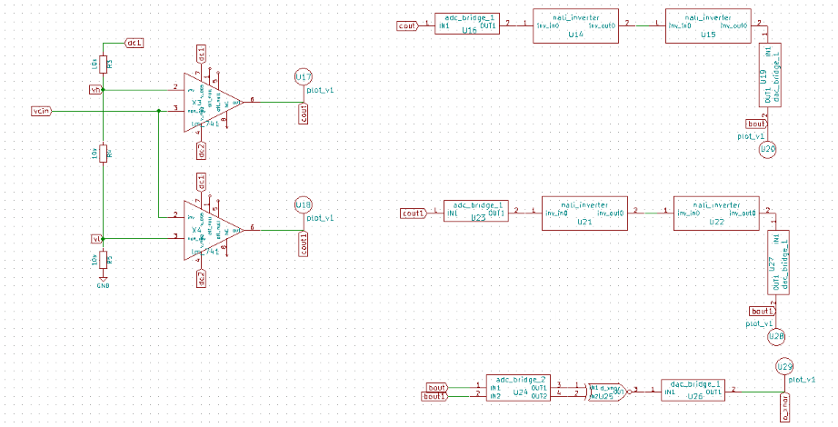
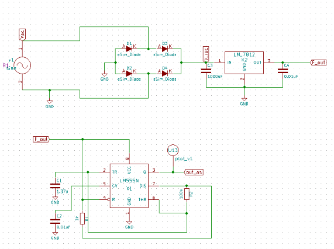
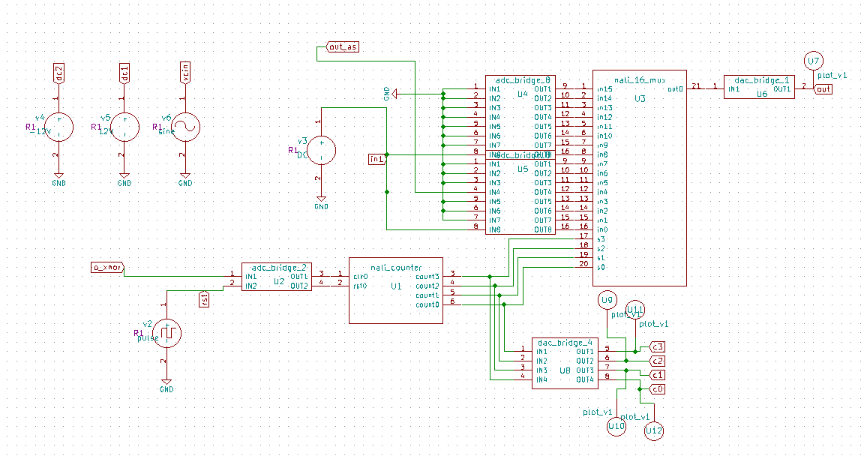
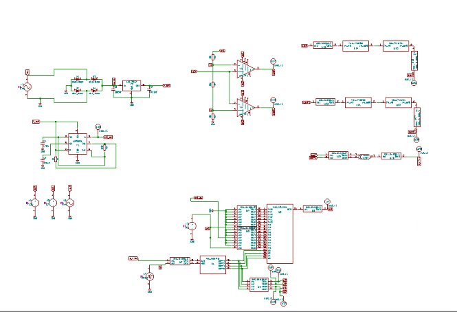
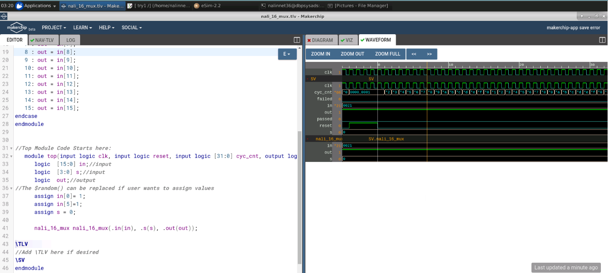
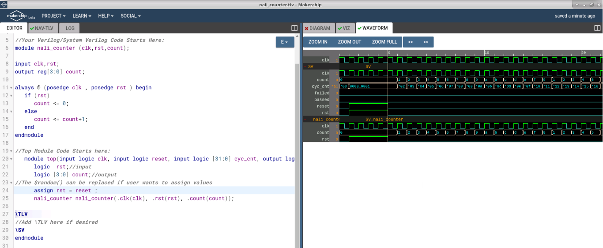
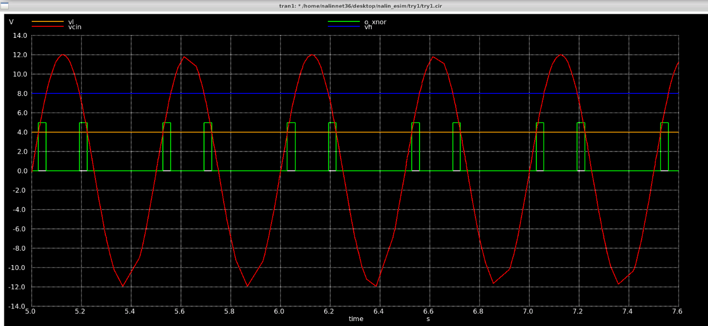
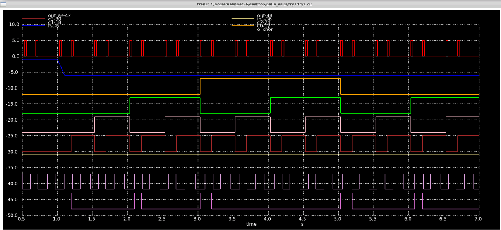

</br>

# 📚 Window Comparator Along With MOD-16 Counter For Counting Based Data Line Selection Operation
</br>


</div>

</br>


This repository gives a detailed report on the design of a Window Comparator Along With MOD-16 Counter For Counting Based Data Line Selection Operation using open-source EDA tools. The simulation being carried out is in mixed-mode (i.e.) both analog and digital simulation. Later the obtained simulation, is verified for it's correctness and functionality.

 
<br>

# 📑 Table of Contents

* [Introduction](#-Introduction) 
* [Window Comparator Along With MOD_16 Counter and 16x1 Mux](#-Window-Comparator-Along-With-MOD-16-Counter-and-16x1-Mux)
* [Software Tools Used](#-Software-Tools-Used) 
* [Implemented Circuit Design using eSim](#-Implemented-Circuit-Design-using-eSim) 
    * [Schematics](#-Schematics) 
    * [Verilog_codes](#-Verilog-codes)
    * [Makerchip](#-Makerchip)
* [Resultant Waveforms](#-Resultant-Waveforms) 
* [Netlist](#-Netlist)
* [Run_this_project](#-Run-this-project)
* [Author](#-Author)
* [Acknowledgements](#-Acknowledgements)
* [References](#-References)


<br>

# 📝 Introduction

Window comparator is a circuit which uses the two comparator in parallel to determine if a signal is between tworeference voltages. If the input signal is outside of the window, the output is Low. If the input signal is within the window, the output is High. A MOD-16 counter has 16 states in its count sequence and used for counting operation. A 16x1 Multiplexer is also used in this design for data selection operation. In this paper, a window comparator along with mod-16 counter followed by 16x1 multiplexer is designed and output waveforms are plotted. This design can be used for two reference voltages based comparing followed by counting based data line selection applications.

 
 </br>

*[Back To Top](#-Table-of-Contents)* ⤴️ 

</br>

# 📝 Window Comparator Along With MOD-16 Counter and 16x1 Mux


The Operational amplifier also known as Op-Amp which are mainly used for mathematical operations like addition, subtraction, integration, differentiation and so on. An Op-Amp
based comparator is used for comparing analogue voltage level with another reference voltage VREF and produce an output signal based on the magnitudes of two input voltages. If the given analog voltage is greater than the reference voltage, the output of comparator is `+VCC` . If the given analog voltage is lower than reference voltage, the output of comparator is `-VCC` . A window comparator is a circuit consists of two Op-Amp in parallel which can take two reference voltages VH and VL and an input analog voltage and produces output based on the comparison of voltages. If the given input voltage lies between two reference voltages, then the output of comparator is `’HIGH’`. Otherwise, the output of comparator is `’LOW’`. This output is given to a MOD-16 counter. MOD-16 counter is also called as 4 bit counter, which have 16 states and count from `’0000’` to `’1111’`. After reaching `’1111’` state it reset to ’0000’ state. The output of comparator is given to 16x1 multiplexer. Multiplexer is a combinational circuit which has maximum of 2n data inputs, `‘n’` selection lines and single output line. Among these data inputs only one will be connected to the output based on the select line values. So, a `16x1` mux have `16` data input lines, `4` select lines and one output line. The output of the `MOD-16` counter is given as input to the `4` select lines of the multiplexer. So, based on the count of counter the corresponding data line is connected to the output line.


# 📝 Software Tools Used

<br>

🌟 eSim 

  * eSim is a free and open-sourced EDA tool for circuit design, simulation, analysis and PCB design. It is an integrated tool built using free/libre and open source software such as KiCad, Ngspice, Verilator, makerchip-app, sandpiper-saas and GHDL. eSim is released under GPL.
  
   🔗 https://esim.fossee.in/home


🌟 KiCad

 * KiCad's Schematic Editor supports everything from the most basic schematic to a complex hierarchical design with hundreds of sheets. It helps to create our own custom symbols or use some of the thousands found in the official KiCad library. We can verify our design with integrated SPICE simulator and electrical rules checker.
    
   🔗 https://www.kicad.org/

🌟 Ngspice

 *  Ngspice is a mixed-level/mixed-signal electronic circuit simulator. Ngspice implements three classes of analysis: nonlinear DC analyses, Nonlinear transient analyses, linear AC analyses.

   🔗 http://ngspice.sourceforge.net/
   
🌟 Verilator

 *  Verilator is a free and open-source software tool which converts Verilog code to a cycle-accurate behavioral model in C++ or SystemC.

   🔗 https://www.veripool.org/verilator/
   
🌟 Makerchip

 *  A web-based IDE that is used to design and simulate digital circuits using Verilog, and the language extension of Verilog, TL-Verilog.

   🔗   https://www.makerchip.com/
   
   
   
 

</br>

*[Back To Top](#-Table-of-Contents)* ⤴️ 

</br>


# 📝 Implemented Circuit Design using eSim

## 📋 Schematics

Schematic designed for window comparator



Schematic designed for astable multivibrator



Schematic designed for 4-bit counter and 16x1 mux 



Complete Schematic design



## 📋 Verilog Codes

- The digital block is the *nali_16_mux.v* which is built using the following verilog code
```verilog
module nali_16_mux (input wire[15:0] in, input wire[3:0] s, output reg out);

always @ (1)
case(s)

	0 : out = in[0];
	1 : out = in[1];
	2 : out = in[2];
	3 : out = in[3];
	4 : out = in[4];
	5 : out = in[5];
	6 : out = in[6];
	7 : out = in[7];
	8 : out = in[8];
	9 : out = in[9];
	10: out = in[10];
	11: out = in[11];
	12: out = in[12];
	13: out = in[13];
	14: out = in[14];
	15: out = in[15];
endcase
endmodule

```

- The digital block is the *nali_counter.v* which is built using the following verilog code
```verilog
module nali_counter (clk,rst,count);

input clk,rst;
output reg[3:0] count;

always @ (posedge clk , posedge rst ) begin
	if (rst)
		count <= 0;
	else
		count <= count+1;
	end
endmodule
```

- The digital block is the *nali_inverter.v* which is built using the following verilog code
```verilog
module nali_inverter (inv_out, inv_in);
	output inv_out;
	input inv_in;
	supply0 GND; 
	supply1 PWR;

	pmos(inv_out, PWR, inv_in);
	nmos(inv_out, GND, inv_in);
endmodule


```


## 📋 Makerchip

* Makerchip Platform


* 16x1 Mux



* 4-Bit Counter



# 📝 Resultant Waveforms

Resultant waveform of window comparator



Resultant waveform of Window Comparator Along With MOD-16 Counter and 16x1 Mux




</br>

*[Back To Top](#-Table-of-Contents)* ⤴️ 

</br>

# 📝 Netlist

The Netlist for the designed circuit is generated after simulating the circuit.

```
* /home/nalinnet36/desktop/nalin_esim/try1/try1.cir

.include lm555n.sub
.include lm_741.sub
.include LM7812.sub
.include D.lib
v1  vac gnd sine(0 20 1 0 0)
d2 gnd gnd 1N4148
d4 gnd v_rec 1N4148
c3  v_rec gnd 1000uf
d1 gnd vac 1N4148
d3 vac v_rec 1N4148
c4  f_out gnd 0.01uf
x2 v_rec gnd f_out LM7812
x1 gnd net-_c1-pad1_ out_as f_out net-_c2-pad1_ net-_c1-pad1_ net-_r1-pad2_ f_out lm555n
r1  f_out net-_r1-pad2_ 1k
r2  net-_r1-pad2_ net-_c1-pad1_ 100k
c1  net-_c1-pad1_ gnd 1.37u
c2  net-_c2-pad1_ gnd 0.01uf
* u13  out_as plot_v1
x3 ? vh vcin dc2 ? cout dc1 ? lm_741
x4 ? vcin vl dc2 ? cout1 dc1 ? lm_741
v5  dc1 gnd 12v
r4  vh vl 10k
r5  vl gnd 10k
r3  dc1 vh 10k
v6  vcin gnd sine(0 12 2 0 0)
* u16  cout net-_u14-pad1_ adc_bridge_1
* u19  net-_u15-pad2_ bout dac_bridge_1
* u20  bout plot_v1
* u17  cout plot_v1
v4  dc2 gnd -12v
* u18  cout1 plot_v1
* u23  cout1 net-_u21-pad1_ adc_bridge_1
* u27  net-_u22-pad2_ bout1 dac_bridge_1
* u28  bout1 plot_v1
* u29  o_xnor plot_v1
* u24  bout bout1 net-_u24-pad3_ net-_u24-pad4_ adc_bridge_2
* u26  net-_u25-pad3_ o_xnor dac_bridge_1
* u25  net-_u24-pad3_ net-_u24-pad4_ net-_u25-pad3_ d_xnor
* u12  c0 plot_v1
* u10  c1 plot_v1
* u9  c2 plot_v1
* u11  c3 plot_v1
* u8  net-_u1-pad6_ net-_u1-pad5_ net-_u1-pad4_ net-_u1-pad3_ c3 c2 c1 c0 dac_bridge_4
* u7  out plot_v1
v2  rst gnd pulse(5 0 1 0 0 20 20)
* u6  net-_u3-pad21_ out dac_bridge_1
* u2  o_xnor rst net-_u1-pad1_ net-_u1-pad2_ adc_bridge_2
* u5  gnd gnd gnd out_as gnd gnd gnd in1 net-_u3-pad9_ net-_u3-pad10_ net-_u3-pad11_ net-_u3-pad12_ net-_u3-pad13_ net-_u3-pad14_ net-_u3-pad15_ net-_u3-pad16_ adc_bridge_8
* u4  gnd gnd gnd gnd gnd gnd gnd in1 net-_u3-pad1_ net-_u3-pad2_ net-_u3-pad3_ net-_u3-pad4_ net-_u3-pad5_ net-_u3-pad6_ net-_u3-pad7_ net-_u3-pad8_ adc_bridge_8
v3 in1 gnd  dc 5
* u14  net-_u14-pad1_ net-_u14-pad2_ nali_inverter
* u15  net-_u14-pad2_ net-_u15-pad2_ nali_inverter
* u21  net-_u21-pad1_ net-_u21-pad2_ nali_inverter
* u22  net-_u21-pad2_ net-_u22-pad2_ nali_inverter
* u1  net-_u1-pad1_ net-_u1-pad2_ net-_u1-pad3_ net-_u1-pad4_ net-_u1-pad5_ net-_u1-pad6_ nali_counter
* u3  net-_u3-pad1_ net-_u3-pad2_ net-_u3-pad3_ net-_u3-pad4_ net-_u3-pad5_ net-_u3-pad6_ net-_u3-pad7_ net-_u3-pad8_ net-_u3-pad9_ net-_u3-pad10_ net-_u3-pad11_ net-_u3-pad12_ net-_u3-pad13_ net-_u3-pad14_ net-_u3-pad15_ net-_u3-pad16_ net-_u1-pad3_ net-_u1-pad4_ net-_u1-pad5_ net-_u1-pad6_ net-_u3-pad21_ nali_16_mux
a1 [cout ] [net-_u14-pad1_ ] u16
a2 [net-_u15-pad2_ ] [bout ] u19
a3 [cout1 ] [net-_u21-pad1_ ] u23
a4 [net-_u22-pad2_ ] [bout1 ] u27
a5 [bout bout1 ] [net-_u24-pad3_ net-_u24-pad4_ ] u24
a6 [net-_u25-pad3_ ] [o_xnor ] u26
a7 [net-_u24-pad3_ net-_u24-pad4_ ] net-_u25-pad3_ u25
a8 [net-_u1-pad6_ net-_u1-pad5_ net-_u1-pad4_ net-_u1-pad3_ ] [c3 c2 c1 c0 ] u8
a9 [net-_u3-pad21_ ] [out ] u6
a10 [o_xnor rst ] [net-_u1-pad1_ net-_u1-pad2_ ] u2
a11 [gnd gnd gnd out_as gnd gnd gnd in1 ] [net-_u3-pad9_ net-_u3-pad10_ net-_u3-pad11_ net-_u3-pad12_ net-_u3-pad13_ net-_u3-pad14_ net-_u3-pad15_ net-_u3-pad16_ ] u5
a12 [gnd gnd gnd gnd gnd gnd gnd in1 ] [net-_u3-pad1_ net-_u3-pad2_ net-_u3-pad3_ net-_u3-pad4_ net-_u3-pad5_ net-_u3-pad6_ net-_u3-pad7_ net-_u3-pad8_ ] u4
a13 [net-_u14-pad1_ ] [net-_u14-pad2_ ] u14
a14 [net-_u14-pad2_ ] [net-_u15-pad2_ ] u15
a15 [net-_u21-pad1_ ] [net-_u21-pad2_ ] u21
a16 [net-_u21-pad2_ ] [net-_u22-pad2_ ] u22
a17 [net-_u1-pad1_ ] [net-_u1-pad2_ ] [net-_u1-pad3_ net-_u1-pad4_ net-_u1-pad5_ net-_u1-pad6_ ] u1
a18 [net-_u3-pad1_ net-_u3-pad2_ net-_u3-pad3_ net-_u3-pad4_ net-_u3-pad5_ net-_u3-pad6_ net-_u3-pad7_ net-_u3-pad8_ net-_u3-pad9_ net-_u3-pad10_ net-_u3-pad11_ net-_u3-pad12_ net-_u3-pad13_ net-_u3-pad14_ net-_u3-pad15_ net-_u3-pad16_ ] [net-_u1-pad3_ net-_u1-pad4_ net-_u1-pad5_ net-_u1-pad6_ ] [net-_u3-pad21_ ] u3
* Schematic Name:                             adc_bridge_1, NgSpice Name: adc_bridge
.model u16 adc_bridge(in_low=1.0 in_high=2.0 rise_delay=1.0e-9 fall_delay=1.0e-9 ) 
* Schematic Name:                             dac_bridge_1, NgSpice Name: dac_bridge
.model u19 dac_bridge(out_low=0.0 out_high=5.0 out_undef=0.5 input_load=1.0e-12 t_rise=1.0e-9 t_fall=1.0e-9 ) 
* Schematic Name:                             adc_bridge_1, NgSpice Name: adc_bridge
.model u23 adc_bridge(in_low=1.0 in_high=2.0 rise_delay=1.0e-9 fall_delay=1.0e-9 ) 
* Schematic Name:                             dac_bridge_1, NgSpice Name: dac_bridge
.model u27 dac_bridge(out_low=0.0 out_high=5.0 out_undef=0.5 input_load=1.0e-12 t_rise=1.0e-9 t_fall=1.0e-9 ) 
* Schematic Name:                             adc_bridge_2, NgSpice Name: adc_bridge
.model u24 adc_bridge(in_low=1.0 in_high=2.0 rise_delay=1.0e-9 fall_delay=1.0e-9 ) 
* Schematic Name:                             dac_bridge_1, NgSpice Name: dac_bridge
.model u26 dac_bridge(out_low=0.0 out_high=5.0 out_undef=0.5 input_load=1.0e-12 t_rise=1.0e-9 t_fall=1.0e-9 ) 
* Schematic Name:                             d_xnor, NgSpice Name: d_xnor
.model u25 d_xnor(rise_delay=1.0e-9 fall_delay=1.0e-9 input_load=1.0e-12 ) 
* Schematic Name:                             dac_bridge_4, NgSpice Name: dac_bridge
.model u8 dac_bridge(out_low=0.0 out_high=5.0 out_undef=0.5 input_load=1.0e-12 t_rise=1.0e-9 t_fall=1.0e-9 ) 
* Schematic Name:                             dac_bridge_1, NgSpice Name: dac_bridge
.model u6 dac_bridge(out_low=0.0 out_high=5.0 out_undef=0.5 input_load=1.0e-12 t_rise=1.0e-9 t_fall=1.0e-9 ) 
* Schematic Name:                             adc_bridge_2, NgSpice Name: adc_bridge
.model u2 adc_bridge(in_low=1.0 in_high=2.0 rise_delay=1.0e-9 fall_delay=1.0e-9 ) 
* Schematic Name:                             adc_bridge_8, NgSpice Name: adc_bridge
.model u5 adc_bridge(in_low=1.0 in_high=2.0 rise_delay=1.0e-9 fall_delay=1.0e-9 ) 
* Schematic Name:                             adc_bridge_8, NgSpice Name: adc_bridge
.model u4 adc_bridge(in_low=1.0 in_high=2.0 rise_delay=1.0e-9 fall_delay=1.0e-9 ) 
* Schematic Name:                             nali_inverter, NgSpice Name: nali_inverter
.model u14 nali_inverter(rise_delay=1.0e-9 fall_delay=1.0e-9 input_load=1.0e-12 instance_id=1 ) 
* Schematic Name:                             nali_inverter, NgSpice Name: nali_inverter
.model u15 nali_inverter(rise_delay=1.0e-9 fall_delay=1.0e-9 input_load=1.0e-12 instance_id=1 ) 
* Schematic Name:                             nali_inverter, NgSpice Name: nali_inverter
.model u21 nali_inverter(rise_delay=1.0e-9 fall_delay=1.0e-9 input_load=1.0e-12 instance_id=1 ) 
* Schematic Name:                             nali_inverter, NgSpice Name: nali_inverter
.model u22 nali_inverter(rise_delay=1.0e-9 fall_delay=1.0e-9 input_load=1.0e-12 instance_id=1 ) 
* Schematic Name:                             nali_counter, NgSpice Name: nali_counter
.model u1 nali_counter(rise_delay=1.0e-9 fall_delay=1.0e-9 input_load=1.0e-12 instance_id=1 ) 
* Schematic Name:                             nali_16_mux, NgSpice Name: nali_16_mux
.model u3 nali_16_mux(rise_delay=1.0e-9 fall_delay=1.0e-9 input_load=1.0e-12 instance_id=1 ) 
.tran 0.1e-00 20e-00 0e-00

* Control Statements 
.control
run
print allv > plot_data_v.txt
print alli > plot_data_i.txt
plot v(out_as)
plot v(bout)
plot v(cout)
plot v(cout1)
plot v(bout1)
plot v(o_xnor)
plot v(c0)
plot v(c1)
plot v(c2)
plot v(c3)
plot v(out)
.endc
.end


```
</br>

*[Back To Top](#-Table-of-Contents)* ⤴️ 

</br>

# 🚶 Run this project 

1. Clone this repository locally 
```
git clone https://github.com/Nalinkumar2002/window_comp_counter_mux_esim_ms.git
```
2. Go to *nali_win_comp_count_mux* directory
```
cd nali_win_comp_count_mux
```

3. Create the Ngveri models and Run NgSpice
```
ngspice nali_win_comp_count_mux.cir.out
```

# 📜 Author
 
 🖊️ Nalinkumar S, Pre-Final year student, B.E. ECE, Madras Institute of Technology, Anna University, Chennai, India
 
 
# 🎓 Acknowledgements

 📖 Kunal Ghosh, Co-Founder of VLSI System Design (VSD) Corp. Pvt. Ltd. - kunalpghosh@gmail.com
 
 📖 Sumanto Kar, eSim Team, FOSSEE
 
 📖 Steve Hoover, Founder, Redwood EDA
 
 📖 FOSSEE, IIT Bombay

# 🔍 References

📔 Laknaur, R. Xiao, S. Durbha and H. Wang, ”Design of a Window Comparator with Adaptive Error Threshold for Online Testing Applications,”
8th International Symposium on Quality Electronic Design (ISQED’07),
2007.

📔  R. Singh and K. S. Pande, ”4-bit Counter Using High-Speed Low-Voltage
CML D-Flipflops,” 2018 3rd International Conference on Communication
and Electronics Systems (ICCES), 2018.

📔  J. Park, J. Song, S. Lim and S. Kim, ”A high speed and low power
41 multiplexer with cascoded clock control,” 2010 IEEE Asia Pacific
Conference on Circuits and Systems, 2010.
